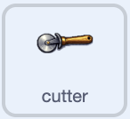

## Animate the equipment

Make your equipment wiggle so the shop feels alive.

> [!TASK]
>
> Add this script to your first piece of equipment. It points the sprite in direction `90` to start level, then rocks it back and forth forever.
>
> <p align="center"></p>
>
> ```blocks3
> when green flag clicked
> point in direction (90)
> forever
> turn right (10) degrees
> wait (0.2) seconds
> turn left (10) degrees
> wait (0.2) seconds
> turn left (10) degrees
> wait (0.2) seconds
> turn right (10) degrees
> wait (0.2) seconds
> end
> ```

> [!TASK]
>
> Add the same script to your other equipment sprites by dragging it onto each one in the sprite list.

Click the green flag. Each equipment sprite should rock gently from side to side and return to its starting direction after every wiggle.
